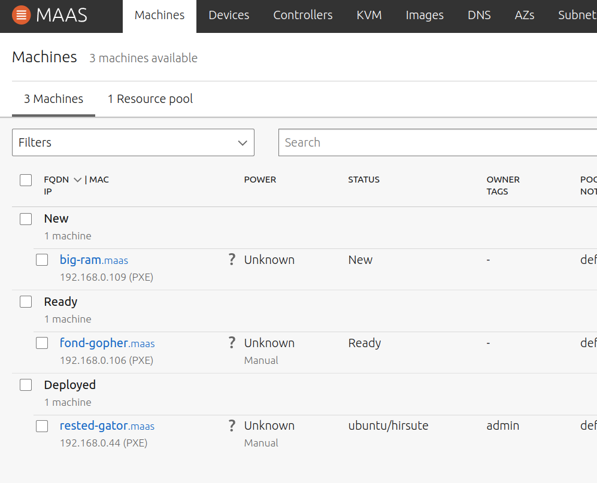

# Commissioning a Raspberry Pi 4 with Canonical MAAS

These steps were successful in commissioning a Raspberry Pi 4 with 
4 GB of RAM using Ubuntu LTS 20.04. I used an SD Card for UEFI and 
a USB3 drive (32GB thumbnail) for OS install.

# Install MAAS
First install Canonical's MAAS as per the instructions here:

- https://maas.io/docs/snap/3.0/ui/maas-installation?utm_source=thenewstack&utm_medium=website&utm_campaign=platform

At present (Feb 2022) during the selection of Ubuntu images will include the 
latest LTS 20.04. You may also choose a more recent version for deployment if 
desired. Only LTS versions are allowed for Commissioning, but you may 
deploy later versions. I chose to use LTS 20.04 for commissioning and deployment.

20.04 default kernel will not work with Pis. To fix this issue go to the MAAS UI
and choose Settings->Configuration->Commissioning and set Default minimum 
kernel version to focal (hwe-20.04)

# Setup the Pi to PXE boot

First create a UEFI SD Card. If you still have a Pi running raspi OS, 
you can put the SD Card in it and
run the script here [uefi.make.sh](uefi.make.sh). If not then use these steps:

- Download the latest zip from 
    - https://github.com/pftf/RPi4/releases
- format an SD card using these instructions

    - https://www.stephenwagner.com/2020/03/21/create-boot-partition-layout-raspberry-pi/
- unzip the contents of RPi4_UEFI_Firmware_v1.32.zip (or higher) into
  the root of the SD card.

Now set up UEFI and do a PXE boot  
- make sure your pi is setup to boot from SD then USB by running raspi-config
  and going to Advanced Options -> Boot Order
 reboot and hit ESC to go into settings
- Go to DEVICE->RaspberryPi  Configuration-> Advanced and set Limit RAM to 3 GB to Disabled
- I also went into Boot Options -> Delete Boot Options and removed everything 
  except PXE boot over IPv4. This guarantees that the PI will always contact MAAS
  on a reboot (Once the machine is Deployed MAAS will tell it to continue the boot
  from the USB drive)
- reboot again
- You should see PXE boot like this

# Commission and Deploy

Go back to the MAAS GUI and choose the Machines Tab. 

All being well your Pi Should appear under the 'New' group like 'big-ram' below.

You can now click on the new machine and see a summary. 
Go to the machine Configuration Tab an set Power Configuration to Manual. 
Use the Take Action button to choose the Test command. 

IMPORTANT: Select the tick box 'Allow SSH access and prevent machine powering off'

You will now need to manually power cycle the Pi to kick off this process.

Note that if you are seeing the console output of the machine then you will see
`reached cloud init target`. When you see this and MAAS UI shows status 'Ready'
you should power cycle the machine. Clearly this would be smoother if some
kind of remote power was added to the setup.

You can now watch progress in the Logs tab. When you see the this message,
It is time to do another power cycle. Eventually you should see the logs say:

- Node changed status - From 'Testing' to 'Ready'

If you move straight to deploying now then MAAS will try to put Ubuntu on 
The SD Card, it will fail and the Pi won't reboot since UEFI has been overwritten.
So first go to the Storage tab for your machine. And do the following:

- Available disks and partitions: remove both partitions of the sdcard
- Available disks and partitions: remove physical disk of the sdcard 
- Change Storage Layout: Flat

Select 'Change storage layout'
and choose 'Flat'. Your Storage tab should now look similar to this:

You are now ready to deploy  your Pi. This will install the OS onto the
USB disk.
Choose Take Action -> Deploy.
Make sure you select 'Allow SSH access and prevent machine powering off'
You will need a power cycle to kick off the deployment .
Continue to watch the logs and you will eventually see:

- Node changed status - From 'Ready' to 'Deployed'

You are good to go. Note that you can ssh into the newly deployed machine 
using:

- ssh ubuntu@machine-name

Assuming your identity is one of you github SSH keys then you should 
be admitted.

Below is an example summary screen for a deployed Raspberry Pi.

